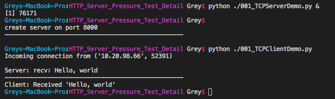
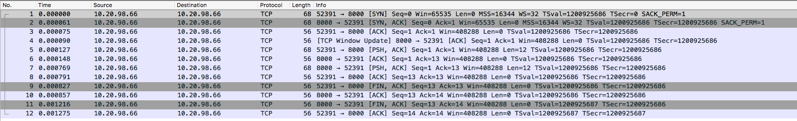
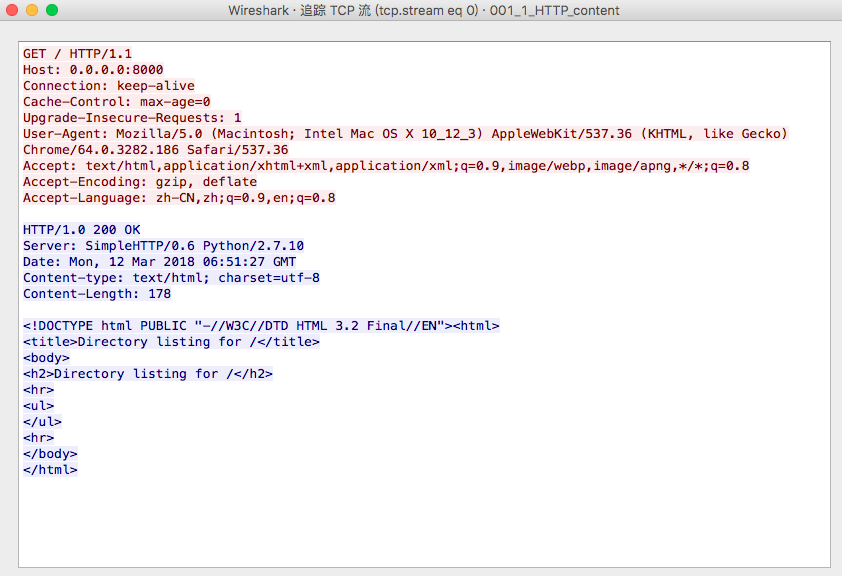

# HTTP Server Pressure Test Detail

索引

* [TCP是什么](#tcp)
* [运行方式](#operation)
  * [Demo程序](#demo)
  * [数据包](#data)
    * [链接创建：三次握手（three-way handshake）](#open)
    * [链接断开：四次挥手（four-way handshake）](#close)
  * [TCP的状态机](#fsm)
* [浅析HTTP](#http)
  * [对HTTP服务器进行压力测试易出现的问题](#problem)
  * [TIME_WAIT缘由](#time_wait)
  * [解决思路](#settled)
  * [问题的结果](#result)
* [参考](#reference)
* [写在最后](#last)

<h2 id="tcp">TCP是什么</h2>

传输控制协议（英语：Transmission Control Protocol，缩写为 TCP）是一种面向连接的、可靠的、基于字节流的传输层通信协议。在简化的计算机网络OSI模型中,位于网络层（IP层）之上，应用层之下。

使用场景：不同主机的应用层之间经常需要可靠的、像管道一样的连接。

<h2 id="operation">运行方式</h2>

<h3 id="demo">Demo程序</h3>

TCP协议的运行大致可分为三个阶段：链接创建、数据传输和链接断开，接下来通过一个简易的Client/Server来了解下这几个阶段。

* [TCPClientDemo.py](./TCPClientDemo.py)（阻塞）
* [TCPServerDemo.py](./TCPServerDemo.py)（IO复用）

`提问：ip地址"0.0.0.0"代表的是什么意思？"127.0.0.1"呢？`

通过先执行Server Demo，可以看出TCP的交互是先有一个以绑定好指定端口的socket在等待新链接的到来；接着运行的ClientDemo，客户端（client）的socket连向刚被监听的端口，当完成链接创建的“三次握手”之后，client socket的connect函数便完成并返回，下一步就可以进行数据的传输；client先发送给server数据包，然后server返回该数据包后并将其内容打印出来，然后双方断开链接。

<h3 id="data">数据包</h3>

从上面打印出的log看，不足以让我们详细的了解C／S之间的交互过程，可以通过借助[网络包分析工具](https://www.wireshark.org/)来了解通信过程中TCP协议发送了哪些数据包。

* [数据包文件](./TCP_all_packet.pcapng)

一开始，服务端开始监听端口时，还未开始有数据包交互。接着，client socket开始连接指定的服务端端口，上面我们说到，TCP是像管道一样的连接，在Demo程序中，管道的一端是服务端的`8000`端口，另一端则是客户端在进行创建链接前，由操作系统随机生成的`52391`端口。

`提问：client socket的端口是否能跟服务端一样也指定某个特定端口？`

<h4 id="open">链接创建：三次握手（three-way handshake）</h4>

链接创建时，先由客户端发送一个SYN数据包至准备连接的服务器端口，而后，服务端将返回一个ACK数据包表示对SYN数据包的确认同时也发送另外一个SYN数据包到客户端，然后，客户端再对这个返回的SYN数据包进行确认（发送ACK数据包），当这三个步骤完成时，也就表示链接创建的完成。（例图 No.1-No.3）

<h4 id="close">链接断开：四次挥手（four-way handshake）</h4>

TCP链接是全双工的，即表示数据在两个方向上能同时传递数据，因此需要在两个方向上单独地进行关闭。当管道的其中一端收到FIN数据包时，意味着这个方向上已经完成了数据的传输，不再在这个方向上继续发送数据；当一端收到FIN时，仍可以继续发送数据，当发送完之后，也将发送另一个FIN完全关闭该链接。四次挥手指的是两次关闭连接的FIN数据包以及对应的ACK包用以做确认。（例图 No.9-No.12）

<h3 id="fsm">TCP的状态机</h3>

尽管我们前面说道，TCP是像管道一样的，可实际上，**网络上的传输时没有连接的，包括TCP也是一样**，它只是在通讯的双方维护一个“连接状态”，让它看起来好像有连接一样。所以，认识TCP的状态变换是非常重要的。

上图便是三次握手、四次挥手的各个状态转换，下面再放一个完整的TCP状态机，方便读者做一个全局的参考。

<h2 id="http">浅析HTTP</h2>

通过抓取访问本地启动的**SimpleHTTPServer**，我们来了解下位于应用层的HTTP协议是如何通过TCP协议来进行通信的。

`Tip: SimpleHTTPServer可通过命令“python -m SimpleHTTPServer”启动，项目目录下已有一份已抓取好的网络包（001_1_HTTP_content.pcapng）`

* [HTTPClientDemo.py](./HTTPClientDemo.py)

查看TCP数据包的内容，我们可以看出，HTTP协议是在TCP协议的基础上，使用带有特定格式的字符串内容。对于简单的HTTP接口调用，其实只是把访问的地址包装进特定位置，其他都采用默认值即可发起HTTP请求。

<h3 id="problem">对HTTP服务器进行压力测试易出现的问题</h3>

为了方便演示，笔者找了额外的机器搭建了一个Nginx服务器用于演示。

在此次测试中，采用官方TCP网络库**asyncore**配合协程库**gevent**做一个简约的并发操作，为方便理解，请求头用一个固定简短的字符串：
~~~python
send_data_alive = '''\
GET / HTTP/1.1
Host: 10.20.79.147:8000
Connection: keep-alive

'''
~~~

* [HTTPClientDemoMultiAsync.py](./HTTPClientDemoMultiAsync.py)（并发Demo）

在笔者的机器上，通过执行该并发程序，发起500个并发请求至服务器，响应正常，这样就可以确认我们的测试服务器是没有问题的，能负载住这样的并发压力（笔者并不是一开始就选中Nginx的，曾试用其他HTTP服务器，比如python自带的SimpleHTTPServer，但效果不理想，经过多次挑选才找到的Nginx，要验证问题，多个方案相互比较也是很重要的）。

但当反复执行这个并发程序多次的时候，出现了异常报错的信息。

~~~python
Traceback (most recent call last):
  File "/usr/local/lib/python2.7/site-packages/gevent/greenlet.py", line 536, in run
    result = self._run(*self.args, **self.kwargs)
  File "001_HTTPClientDemoMultiAsync.py", line 16, in __init__
    self.connect( (host, PORT) )
  File "/usr/local/Cellar/python/2.7.14_2/Frameworks/Python.framework/Versions/2.7/lib/python2.7/asyncore.py", line 356, in connect
    raise socket.error(err, errorcode[err])
error: [Errno 49] EADDRNOTAVAIL
Tue Mar 13 15:04:35 2018 <Greenlet at 0x101f68870: HTTPClient('10.20.79.147')> failed with error
~~~

此时我们发现无法正常连接上服务器端口，但静止一段时间后再执行该并发程序又恢复正常，那么我们就可以推测出，程序代码应该可以正常使用的，可能是系统资源用完导致的错误，于是我们接着便开始对系统资源进行诊断。

首先，当程序抛出异常的时候，我们查看下当时系统的网络情况，可发现系统中出现了很多状态为**TIME_WAIT**的链接，数目与并发数一致：
~~~shell
$ netstat -p tcp -n | awk '$6=="TIME_WAIT" {print $4}' | wc -l
     500
~~~

接着，查看该系统的可用端口数，发现可用端口数只有536个：
~~~shell
$ sysctl net.inet.ip.portrange.first net.inet.ip.portrange.last
net.inet.ip.portrange.first: 65000
net.inet.ip.portrange.last: 65535
~~~

所以，当第一次并发程序执行结束退出的时候，系统的链接处于TIME_WAIT状态还没有完成释放，紧跟着执行多几次压测程序（成熟的压测程序是应该不间断持续进行的，这样耗光的速度会更快），便会把资源完全耗光，导致无法进行持续稳定的压力测试。

<h3 id="time_wait">TIME_WAIT缘由</h3>

在上面TCP的状态图中，从TIME_WAIT状态到CLOSED状态，有一个超时设置，这个超时设置是 2*MSL（RFC793定义了MSL为2分钟，Linux设置成了30s）为什么要这有TIME_WAIT？为什么不直接给转成CLOSED状态呢？主要有两个原因：
* 1）TIME_WAIT确保有足够的时间让对端收到了ACK，如果被动关闭的那方没有收到Ack，就会触发被动端重发Fin，一来一去正好2个MSL，
* 2）有足够的时间让这个连接不会跟后面的连接混在一起（你要知道，有些自做主张的路由器会缓存IP数据包，如果连接被重用了，那么这些延迟收到的包就有可能会跟新连接混在一起）。
所以，TIME_WAIT很重要，而且，在大并发的短链接下，这个问题就变得更加严重。

<h3 id="settled">解决思路</h3>

尽管这个状态非常耗时，且不可缺少，但是我们还是有办法避免这个问题。让我们回到TCP四次挥手的图表，我们可以发现，其实，TIME_WAIT只出现在管道中的一端，所以这个状态要么发生在客户端要么发生在服务端。那么，发生在两端都是消耗资源，差别是什么呢？答案是，如果发生在服务端，这个状态下的链接使用的端口是服务器监听的端口，所有在服务端的链接都使用同一个端口，这样将大大减少端口资源的占用（因为一个地址理论上最多只有65535个可用端口）；而去我们还可以看到，哪方先发起的关闭链接，哪方就将进入TIME_WAIT状态，所以，只要每次都由服务端先发起的关闭链接操作，那客户端就能避免这个问题。要由服务端关闭链接，我们只需要将请求头部的Connection属性设为close即可，读者可自行修改压测程序demo，检验结果。

~~~python
send_data_close = '''\
GET / HTTP/1.1
Host: 10.20.79.147:8000
Connection: close

'''
~~~

`提问：服务端链接既然使用的是同一个端口，那是否可以创建无限多个链接？文件描述符又是什么？`

<h3 id="result">问题的结果</h3>

如果不解决进入TIME_WAIT状态的这个问题，我们可以计算一下单一一台压测机器至多只能在一个TIME_WAIT的周期（linux为1分钟）里面完成65535的请求，QPS只有**1100**左右，这将极大的消耗我们的主机资源。换言之，如果服务器的目标QPS低于该值，我们采不采用这个方案就变得不那么重要了。

此外，还有另外一种方案，那便是直接保持keep-alive多次发起HTTP请求，这样就绕过了短链接的问题，这里便不再进行赘述。

<h2 id="reference">参考</h2>

* 酷壳
* wiki
* 其他网络上的资料

<h2 id="last">写在最后</h2>

在结束的地方，想问下读者是否已经掌握文章的主题？

笔者认为没有，因为仅仅通过阅读一篇文章，仅仅只能知道有这么一回事；即便跟着文章的步伐重现所有流程，也只能是知道文章所说的是怎么一回事，当然，一般文章的目的也是如此。但是，读者不知道的是，作者一开始是怎么发现一个问题，如何进行问题的定位，还有解决这个问题，最后，又是如何将这个问题展示给其他人，展示过程中各种细节的选择。而这些，才是一个学习的过程，实践起来，就是一个从读者转变为作者的过程，尽管本文瑕疵偏多，但对笔者自身来说，也是收获满满。

